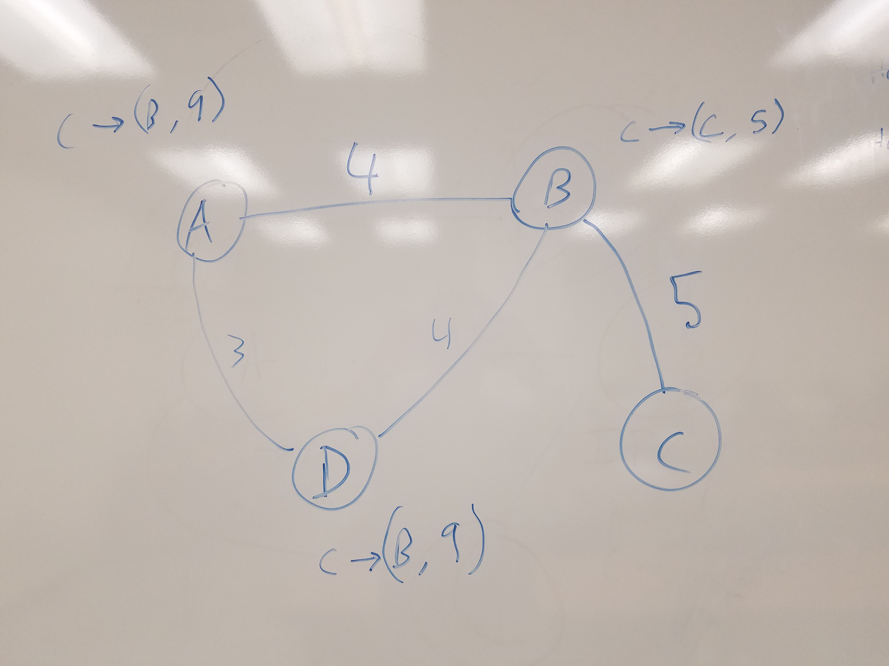

#### Router forwarding table generation:

**When a router is added**

Node that it connects to:

	Broadcasts a message (ONLY ONCE) to all connected nodes that this 
	router connected and it cost this much to get to it from itself
	
	The following routers do the same thing.


When a router recieves a message saying that a new router is connected:

```python
	#Checking if node exists in table
    if(node exists in table):
    	if (new path is shorter):
    		add to table
    else:
    	add to forwarding table

```

Ex:



```
	Router "C" is added and tells router "B". The weight for edge CB is 5.

	Router B adds C to it's forwarding table.

	B tells "A" and "D" that a new node has connected and it costs 5 to get to it through B.

	D and A Both add C to the forwarding table adding the cost to get to B + 5 (cost from B to C).

	D tells A and A ignores the update because it already has a shorter path in its forwarding table.

	A tells D and D ignores the update because it already has a shorter path in its forwarding table.

	Forwarding table updated.
```